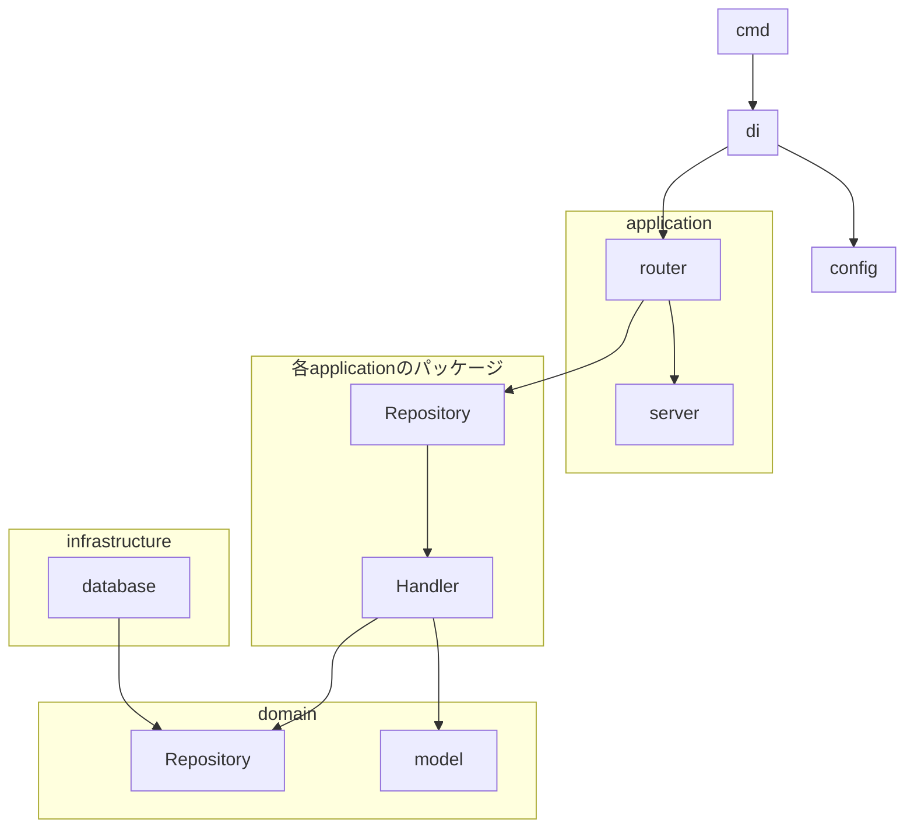

# server

## Usage

```shell
make docker_compose/up

### healthz
curl localhost:8080/healthz

### Create
curl -X POST http://localhost:8080/v1/todos \
-H "Content-Type: application/json" \
-d '{ "title": "タイトル", "description": "内容"}'

### List
curl http://localhost:8080/v1/todos

### Update
curl -X PUT http://localhost:8080/v1/todos/1 \
-H "Content-Type: application/json" \
-d '{ "title": "タイトル2", "description": "内容"}'

### Delete 
curl -X DELETE http://localhost:8080/v1/todos/1 \
-H "Content-Type: application/json"
```

## architecture

依存関係だけしっかりしたい



|directory|用途|
|:---|:---|
|cmd|コマンド。アプリケーションのstartはここから。|
|config|configに関するコード。今回であればtomlを読み込んだりParameterStoreからdecodeしたりする|
|di|依存関係保って順番に初期化していくため|
|application|ServerやRouter周りのロジック|
|application配下の各package|各APIのロジック|
|domain/repository|DIP用のinterfaceを書き込む|
|domain/model|ビジネスロジック。限定共有投稿、公開を切り替えれるなど。domain層はどの層にも依存しない|
|infrastructure|DB、メモリ操作|
|utils|その他|
|migrations|`go-migrate/migrate` でmigrateするためのファイル|


## 実装のコツ
理想系なのでMUSTではないです

### 1. SOLIDを意識して実装すること
- https://dave.cheney.net/2016/08/20/solid-go-design

#### 【S】Single Responsibility Principle: 単一責任の原則
-  1つのクラスは1つの責任を持つべきで、1つしか持ってはいけない。

- structには単一の責務だけ用意してね

#### 【O】Open/Closed Principle：オープン/クローズドの原則
- ソフトウェア構造は拡張のためにオープンであるが、変更のためにクローズされるべき
- = システムを変更しなくても、システムの動作を拡張できる

- 特にswitch caseを注意してね（initialize系とか）

#### 【L】Liskov Substitution Principle：リスコフの置換原則
- 派生型は、基底型を代替可能としなければならない
- = 継承したクラスは継承元のクラスと同じ動作をする必要がある

- Goにはクラスや継承がないため、抽象クラス階層の観点から置換を実装することはできない。
- 代わりにinterfaceがあるので、そのinterface名を明確にしぼって実装してね

#### 【I】Interface Segregation Principle：インタフェース分離の原則
- クライアントは、使用しないメソッドに依存することを強制されるべきではない

- 不要なメソッドがある場合はこれを注意してね

#### 【D】Dependency Inversion Principle：依存関係逆転の原則
- 高レベルのモジュールは、低レベルのモジュールに依存するべきではありません。どちらも抽象化に依存する必要がある
- 抽象化は詳細に依存するべきではありません。詳細は抽象化に依存する必要がある

- application -> domain -> infrastructure と依存する場合、application, domain側にinterface作って依存しようねあおうね
- そうしないとmockが作れなくてテスト出来ないよ

### 2. 凝集度を高くする
単一モジュール（Goだと関数）内の要素間の関連性

|上から高い（good）|レベル|内容|
|:---|:---|:---|
|機能的|理想的|単一の定義されたタスクを実現する関数|
|逐次的|可能な限り小さく|ある関数の出力が、別の関数の入力となるような関数を集めたやつ|
|通信的|可能な限り小さく|同じデータを扱う関数を集めたやつ|
|手順的|可能な限り小さく|順番に実行する必要があるものを集めたやつ。アクセス権を確認してファイルに書き込むとか|
|時間的|可能な限り小さく|時間的に近く動作するものを集めたやつ。初期化処理みたいなもん|
|論理的|可能な限り避ける|似たような関数を集めたやつ|
|偶発的|避けるべき|func main()に全部詰め込む|

### 3. 結合度
|上から弱い（good）|レベル|内容|
|:---|:---|:---|
|メッセージ|理想|引数すらない。データのやり取りもしない|
|データ|理想|単純な引数のやり取り|
|スタンプ|一部ケースで注意|関数の引数に渡された値の一部しか使わない状態。必要な引数だけ渡そうね|
|制御|避ける|関数が実行する命令を外部のデータによって制御している|
|外部|避ける|外部ライブラリやIOデバイスへの接続手段を複数の関数で共有している状態。DBの接続設定は１か所にしましょう|
|共通|避ける|複数の関数が同じグローバルデータにアクセスできる。変更すると副作用が出る|
|内部|避けるべき|ある関数が別の関数の内部動作によって変化したり依存したりする|


### 4. DTO
本来は、下記のダメな部分はあるものの、やりすぎると複雑になるのでDTOは用意してない
- ドメインレイヤーにインフラ層のタグ（ `gorm:"id"` ）が入ってるし
- RDB用のID, CreatedAt, UpdatedAtが入ってしまっているし、
- RDB用のIDとDDD本来のIDとの名前が混同している

### 5. Test
https://github.com/golang/go/wiki/TableDrivenTests
# famili-api
